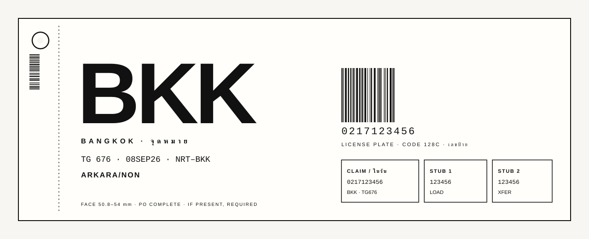
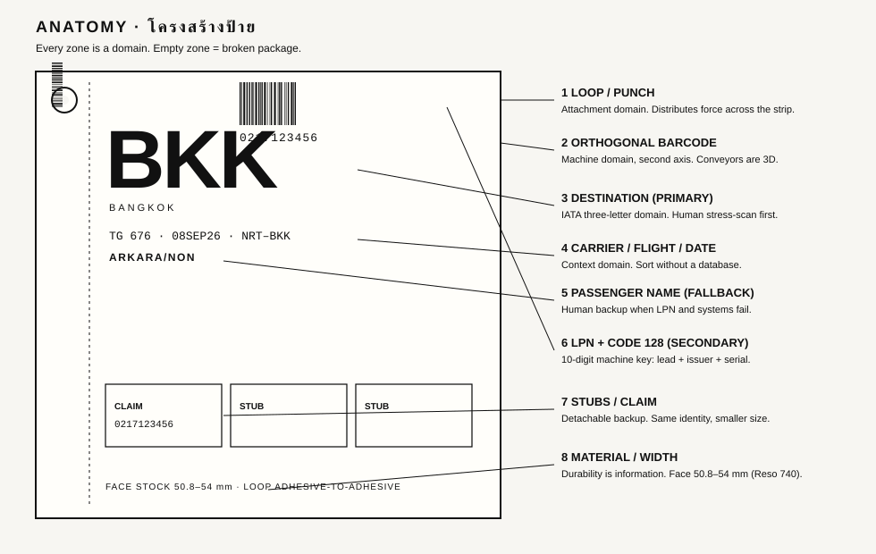
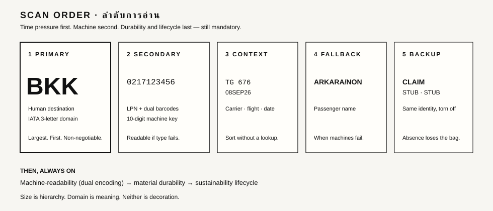
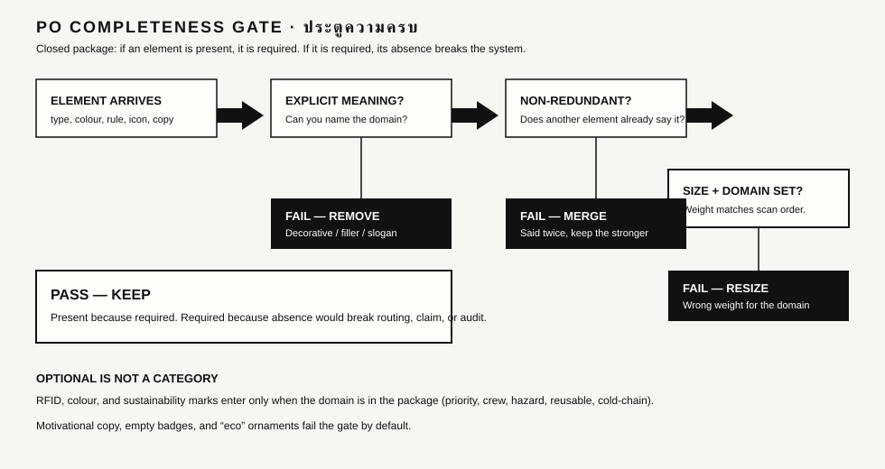
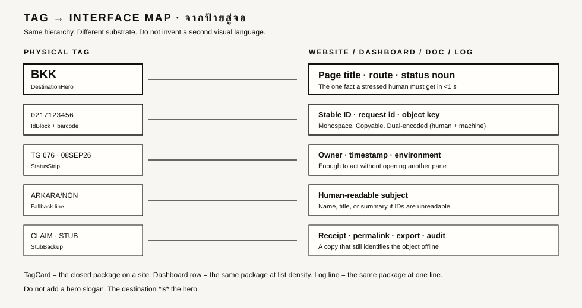
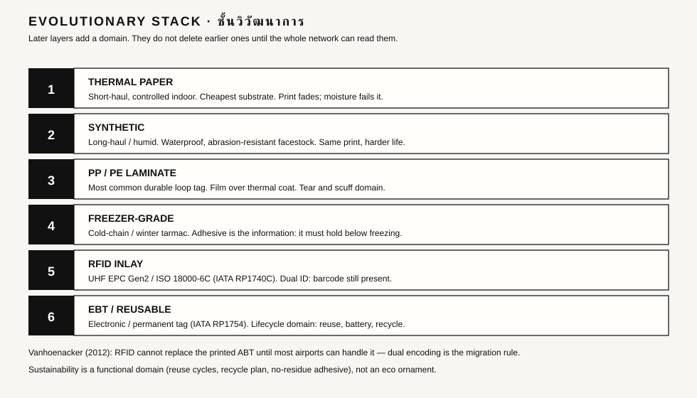

<!-- SPDX-License-Identifier: MIT -->
<p align="center">
  
</p>

# Dr Non’s Luggage Tag Aesthetic Design System

**The white airline baggage tag as a systemic design principle.** Fork it. Recreate the same functional aesthetic for websites, systems, docs, packaging, dashboards, and closed information packages.

[](LICENSE)

Stranger door: [`START-HERE.md`](START-HERE.md) · Live preview: [`examples/gallery/index.html`](examples/gallery/index.html) (open locally, no build) · Agent skill: [`skill/white-baggage-tag-aesthetic/SKILL.md`](skill/white-baggage-tag-aesthetic/SKILL.md)

By [Dr Non Arkaraprasertkul](https://github.com/Nonarkara) (Dr Non / Nonarkara). Independent studio work. **Not an IATA or airline product.**

---

## Philosophy

Every element in the complete package — physical tag, digital UI, system output — must carry **explicit, non-redundant meaning**. No decorative, filler, motivational, or optional text or visual.

**PO Completeness:** if it is present, it is required. If it is required, absence breaks the system.

**Size is information.** Type hierarchy is human scanning order under time pressure, not ornament.

**Domain is information.** IATA three-letter destination, 10-digit LPN, carrier, material durability, sustainability lifecycle — each is a named domain. Colour exists only when priority, crew, or hazard is actually in the package.

**Hierarchy (mandatory order):**

1. Human stress-scan (destination first)
2. Machine-readability (LPN + dual encoding)
3. Durability (substrate, adhesive, contrast)
4. Lifecycle (reuse, recycle, RFID/EBT only when justified)

This is not decorative minimalism. It is the sticky loop on a suitcase handle: closed, complete, silent about everything that is not the bag.

Pilot Mark Vanhoenacker called the automated bag tag a masterpiece of design (*Slate*, 2012). [Nathan Yau / FlowingData](https://flowingdata.com/2012/10/18/masterful-design-of-the-everyday-baggage-tag/) relayed that reading: custom-printed destination and name, bar-coded license plate, still readable by hand when the belt is a black box. This repo treats that object as law.

---

## Quick start

```bash
git clone https://github.com/Nonarkara/dr-non-luggage-tag-aesthetic.git
cd dr-non-luggage-tag-aesthetic
# no install — open the gallery
```

Open `examples/gallery/index.html` in a browser. Copy `design-tokens/tokens.css` and `components/tag-system.css` into your surface. Rebuild **one** object until it is a tag. Run [`docs/critique-checklist.md`](docs/critique-checklist.md).

Agents: load the skill first. Do not invent a palette.

---

## Diagrams

<p></p>

<p></p>

<p></p>

<p></p>

<p></p>

Portrait reference: [`assets/tag-portrait.svg`](assets/tag-portrait.svg) · Mark: [`assets/mark.svg`](assets/mark.svg)

---

## Package map

| Path | Job |
|---|---|
| [`design-tokens/`](design-tokens/) | CSS variables + JSON. Ground, ink, four ranks, spacing, mono, optional domain colours |
| [`components/`](components/) | TagCard, DestinationHero, IdBlock, StatusStrip, StubBackup, DashboardRow |
| [`examples/`](examples/) | (a) website status card (b) API / log line (c) doc header — before/after noise removal |
| [`skill/white-baggage-tag-aesthetic/`](skill/white-baggage-tag-aesthetic/) | Agent-invocable skill v2.0 |
| [`docs/`](docs/) | Anatomy, hierarchy, checklist, 740/753 notes, evolution, sources |
| [`CONTRIBUTING.md`](CONTRIBUTING.md) · [`SECURITY.md`](SECURITY.md) | Lightweight, honest |

Example identifier used everywhere: LPN `0217123456` (lead 0, issuer 217, serial 123456). **Synthetic. Not a live bag.**

---

## Ethics

- Fork the **method**, not secrets or operational systems.
- No live passenger data, real LPNs, or credentials in git.
- No black-box rankings of cities, carriers, or people.
- Bilingual TH–EN is for extra readers (`จุดหมาย`, `ใบรับ`), not extra chrome.
- IATA Resolutions 740 and 753, RP 1740c, and RP 1754 are cited as public standards. This repo does not freeze mishandling statistics; rates change — see [`docs/sources.md`](docs/sources.md).

---

## License

[MIT](LICENSE). Copyright © 2026 Dr Non Arkara.

`SPDX-License-Identifier: MIT`
