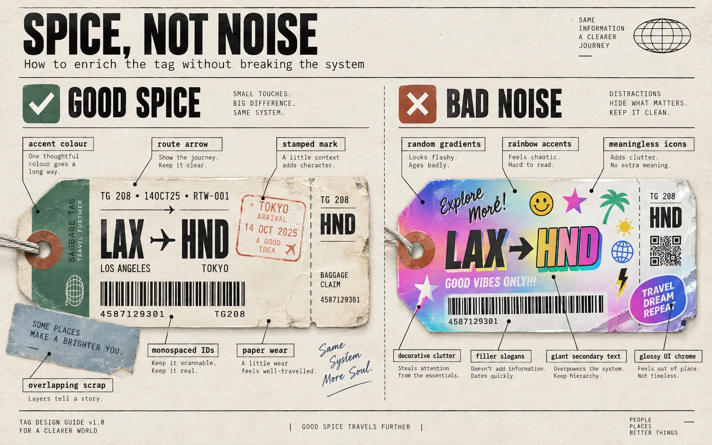

<!-- SPDX-License-Identifier: MIT -->
# Ephemera — the skin, and the roof it lives under

> 1968 baggage room meets 2026 information system. Roughly **65% system, 35% travel ephemera**.
> Not nostalgic kitsch. Not brutalism.

The system had become too clean. A page that obeys every rule and carries no evidence of having been *used* reads as a specification, not an object — and specifications are exactly what a bag tag is not. A real tag has been stamped in Frankfurt, written on in biro at the gate, torn at the perforation, and stapled over a previous tag that nobody removed.

This file adds that layer. It does not loosen the law.

---

## The roof — four rules, non-negotiable

Everything below sits under these. If an ephemeral mark ever fights one of them, the mark loses.

1. **It works for both machines and humans.** Neither reader is the guest.
2. **Information hierarchy and condensation.** The important thing first; everything else compacted and compartmentalised.
3. **MoMA rules — strict, therefore communicative and structurally beautiful.** The discipline is what makes it read, not what makes it cold.
4. **Under that roof, there is room for colour, composition, and character.**

Rule 4 is the one that was missing. Rules 1–3 were being read as a licence for austerity, and austerity is not what any of them ask for. A 1968 tag is *maximally* disciplined and *maximally* characterful at the same time, and there is no tension between those, because the character is carrying information.

---

## The two layers

### Skeleton — the information system

Unchanged. Destination at scan scale · mono ids · barcode logic · perforations · stubs · four ranks · machine and human both served.

**Nothing in this file may weaken the skeleton.** If a stamp covers the destination, the stamp moves. If handwriting makes an id uncopyable, the handwriting goes beside it, not over it. The scan order is tested by squinting until the type blurs: the destination must still be the first thing you see.

### Skin — the ephemera

Irregular tag silhouettes · stacked ticket fragments · diagonal colour blocks · punched eyelets · route lines · handling pictograms · rubber-stamp marks · registration crosses · serial boxes · occasional handwriting.

---

## The rule that keeps this out of kitsch

**A mark may appear only when the event it records actually happened.**

This is the wabi-sabi distinction, and it is the whole difference between an object with a history and a filter pretending to have one. Wabi-sabi is the *record of engagement*. Manufactured wear is a lie told in texture.

| Mark | The event it records | Fake when |
|---|---|---|
| Rubber stamp | A station handled this object | Stamped "PRIORITY" on something with no priority flag |
| Handwriting | A human overrode or annotated the machine | Handwritten labels on generated data |
| Torn perforation | A stub was actually detached | A tear on an object nobody claimed |
| Rotation, 2–4° | The object was *handled*, not placed | Everything rotated, evenly, as a style |
| Registration cross | The press aligned two passes | On a surface printed in one ink |
| Misregistered overprint | A second press pass landed | Larger than a press would drift |
| Thermal fade | Age, heat, or a worn print head | A "vintage" wash over fresh data |
| Staple / stacked fragment | A previous tag was not removed | Layered scraps for texture |

Declare it: `data-event="stamped"`, `data-event="annotated"`, `data-event="claimed"`. The auditor reads these, and a mark without one is decoration wearing a costume.

**The test:** if a reader asked "what happened to this object?", every mark should answer. A mark that cannot answer is removed.

---

## The 65 / 35 mix

Roughly two-thirds system, one-third ephemera, measured by area and by attention — not by count.

- **The 65%** is structure: grid, ranks, ids, rules, the machine-readable layer. It is what the surface *is*.
- **The 35%** is evidence: colour fields, stamps, handwriting, rotation, the accumulated record. It is what the surface *has been through*.

Push past 35% and the object stops being an instrument and becomes a scrapbook. Fall below and it becomes a specification again. The mix is a dial, not a law — but if you cannot say which third is ephemera, you have not composed, you have decorated.

---

## Composition — controlled mess

The reference objects are not laid out. They **accumulated**. Composition should record that.

- **Rotate stubs and secondary fragments 2–4°.** Never the primary destination block — the thing you must read first is the thing that sits straight.
- **Overlap.** A claim stub over a tag corner, a sticker across a rule. Overlap encodes sequence: what was applied last sits on top.
- **Crop at the edge.** A tag running off the canvas reads as part of a larger pile. A tag centred in a box reads as a specimen.
- **Vertical barcodes and vertical route text** — the second reading axis, the job the 90°-offset barcode does.
- **Large numerals partly off-canvas.** A serial cropped by the frame is how a real photograph of a real tag looks.
- **Stop putting everything in a square box.** Irregular silhouettes: notched corners, angled cuts, die-cut stub ends, eyelet tabs.

**The one thing that never moves:** scan order. Rotate the stub, crop the serial, overlap the sticker — the destination stays largest, straightest, and first.

---

## Colour — 60 / 40

About 60% cream and black, about 40% restrained vintage.

Vintage inks: faded cyan · burnt orange · mustard · dusty pink · olive · deep airline blue.

- **One dominant accent pair per surface.** Not one accent — a *pair*, the way a two-colour press job works. Deep blue and burnt orange. Olive and dusty pink.
- **Large flat fields, not tiny accents.** A colour that appears only in 4px rules is decoration. A colour that owns a third of the face is doing a job.
- **Every colour still names a domain** (see [`stocks.md`](stocks.md)). Faded is a *tint of an ink*, never a fourth ink.
- **Faded means desaturated, not translucent.** Real fade loses chroma and gains lightness; it does not become semi-transparent over the thing behind it.

---

## Type — accumulated, not systematised

Four voices, and they arrived at different times, which is the point:

| Voice | Job | Feel |
|---|---|---|
| **Condensed destination** | Rank 1 | Printed by the tag machine |
| **Slab / industrial grotesk** | Headings, station names | Printed by the carrier |
| **Stamped mono** | Ids, serials, times | Struck by a machine or a stamp |
| **Handwritten ops mark** | A human's override | Added at the gate, in biro |

They do not need to harmonise into one scale. A tag accumulates type from four sources over one journey, and forcing them into a single system is exactly the sterility this file exists to correct. **Still four ranks** — the voices vary, the hierarchy does not.

---

## Texture — enough to leave Figma, not enough to become a filter

Subtle thermal fade · registration misalignment · paper fibre · uneven stamp ink · small perforation tears.

**Ceilings, so this stays a print and not a Photoshop action:**

- Fade: never below 4.5:1 contrast on body, 3:1 on large. A faded tag that cannot be read has failed at the only thing a tag does.
- Misregistration: 1–3px. A press drifts; it does not slide.
- Fibre and noise: at most a light overlay, and never over the destination or an id.
- Tears: at a perforation, where a tear would actually occur. Not at a random edge.
- **No drop shadows, no blur, no glassmorphism, no border-radius other than a true circle.** Texture is ink and paper, never depth.

---

## Pictograms — printed instruction, not app icon

1960s–80s handling-instruction style: conveyor, cart, suitcase, route map, aircraft silhouette, scanner beam.

Solid fills and single-weight strokes, geometric, slightly heavy, drawn to survive being printed small on cheap stock. **Not** rounded-corner outline icons, not two-tone, not a modern icon set. Each one names a handling event, and an icon that names nothing is deleted like any other element that fails the gate.

---

## What did not change

PO Completeness · four ranks · dual encoding · a fallback rank · `border-radius: 0` except a true circle · no shadow, blur, or glassmorphism · contrast floors · every number carrying source, tier and age · every edge resolving to another edge.

**The skin is what the object has been through. The skeleton is what it is.**

---

## On the word "brutalist"

This system was never brutalist and should stop being described that way. Brutalism is an argument about honesty of material made through *weight*. This is an argument about honesty of information made through *hierarchy* — a different tradition, closer to Swiss information design and to the printed instruction sheet than to béton brut.

The tell that the description was wrong: brutalist web design is usually loud and hard to read. A bag tag is loud **because** it is easy to read.
