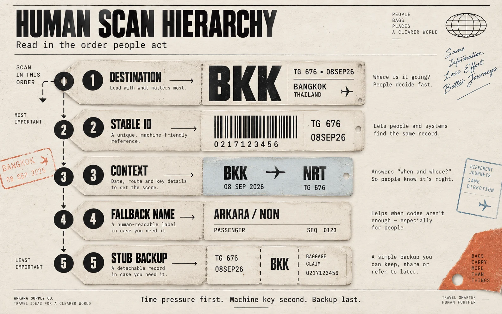
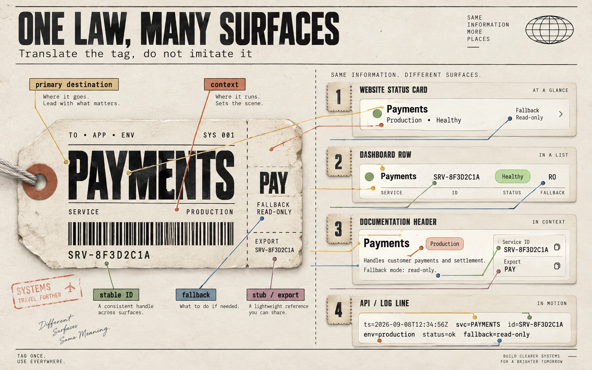

<!-- SPDX-License-Identifier: MIT -->
# Hierarchy rules

Scan order under **time pressure** is the type scale. Machine-readability, durability, and lifecycle are always on, but they do not outrank the human destination.

## Four type ranks (mandatory)

| Rank | Name | Token | Domain | Test |
|---|---|---|---|---|
| 1 | Primary | `--tag-size-dest` | IATA three-letter code, or the destination-equivalent of the package | Readable at arm’s length / from the dashboard door |
| 2 | Secondary | `--tag-size-lpn` + mono | 10-digit LPN / object id + barcode | Copy-pasteable; distinct from the destination |
| 3 | Tertiary | `--tag-size-context` | Carrier, flight, date, owner, environment, tracking point | Enough to act without another pane |
| 4 | Fallback | `--tag-size-fallback` | Passenger name / human subject | Still identifies the object if 1–3 fail |

Stubs are rank 4 at **smaller physical size**, not a fifth voice. Do not invent rank 5 (“caption personality”, “eyebrow gradient”).

## Size is information

Making the LPN larger than the destination says “the machine key is more important than where the bag goes.” That is a domain error, not a taste error.

Making everything 16 px says “there is no time pressure.” That is also a domain error.

## Domain is information

Default package: **ground + ink**. Colour is not a rank.

Domain extensions (tokens `--tag-domain-priority`, `--tag-domain-crew`, `--tag-domain-hazard`) exist only when the package includes that domain:

- **priority** — expedite / rush / SLA (lead-digit 2 analogue)
- **crew** — crew/staff bag
- **hazard** — hold / DG / blocking alert

A coloured left rule on a dashboard row means the domain is in the record. A coloured rule “for energy” fails PO.

## Interface mapping

| Tag zone | Website | Dashboard | Docs | Log |
|---|---|---|---|---|
| Destination | Page or card title (noun) | First column, huge | Spec number / doc destination | First token |
| LPN + bars | Stable id, copyable | Monospace id | Permalink / slug | `lpn=` / `id=` |
| Flight strip | Owner, env, time | Status cells | Date, owner | `flt=` `date=` `point=` |
| Name | Subject line | Last cell | Human title | `pax=` / `subject=` |
| Stubs | Receipt, export, permalink | Row action that leaves a copy | Cite / download | Repeatable line |

Do not add a slogan above the destination. The destination is the hero.
